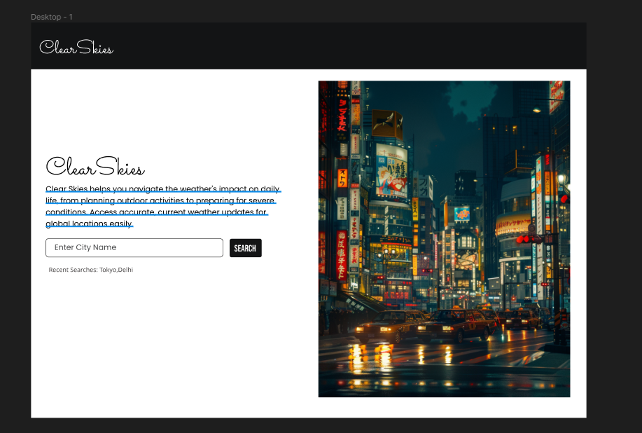

# Software Requirements Specification for ClearSkies

## 1. Introduction
This Software Requirements Specification (SRS) document details the specifications and design for ClearSkies, a dynamic weather forecasting website. This document aims to outline the functional and non-functional requirements, describe the intended user interactions, and provide a blueprint for the development, deployment, and maintenance of the system using the MERN stack and OpenWeather API.

### 1.1 Purpose
The purpose of this SRS is to ensure the clear understanding and agreement of the website's functionalities and constraints between stakeholders and the development team. The document will serve as a reference throughout the development process.

### 1.2 Scope
ClearSkies will provide users with access to real-time weather information, forecasts, air quality indexes, and a feature to view the most searched weather locations. It aims to offer intuitive navigation and reliable data sourced from the OpenWeather API to users globally.

### 1.3 Definitions, Acronyms, and Abbreviations
- **API** - Application Programming Interface
- **MERN** - MongoDB, Express.js, React, Node.js
- **SRS** - Software Requirements Specification

### 1.4 References
- OpenWeather API documentation
- MERN stack development guides

### 1.5 Overview
The remainder of this document provides a detailed description of the functionality, user interface, performance requirements, and other critical factors necessary for the successful implementation of ClearSkies.

## 2. Overall Description
### 2.1 Product Perspective
ClearSkies is an independent product that interacts with the OpenWeather API to fetch and display weather data. It will operate within a web environment accessible through standard web browsers.

### 2.2 Product Features
- Real-time weather updates including temperature, humidity, and wind
- Daily and weekly weather forecasts
- Air quality index for specified locations
- Search functionality for global locations
- Display of trending or most searched locations

### 2.3 User Classes and Characteristics
- **General Users:** Individuals seeking current and forecasted weather details.
- **Administrative Users:** System administrators responsible for managing website functionality.

### 2.4 Operating Environment
ClearSkies will be hosted on a cloud platform, ensuring availability and scalability. It will be accessible via web browsers on desktops, tablets, and smartphones.

### 2.5 Design and Implementation Constraints
- The website is to be developed using the MERN stack.
- Dependency on the external OpenWeather API for all weather-related data.
- Requires continuous internet connectivity.

### 2.6 Assumptions and Dependencies
- The availability and continued operation of the OpenWeather API.
- User access to a stable internet connection.

## 3. System Features
### 3.1 Weather Forecast Display
**Description:** Users will be able to view current weather conditions and a five-day forecast.
**Requirements:**
- Display temperature, humidity, precipitation, and wind information.
- Update weather information at least every 30 minutes.

### 3.2 Air Quality Index
**Description:** The system will provide air quality reports for searched locations.
**Requirements:**
- Display current AQI levels with descriptions of associated health impacts.

### 3.3 Search Functionality
**Description:** Users can search for weather by city or region.
**Requirements:**
- Provide autocomplete suggestions based on the input.
- Retrieve and display results quickly and accurately.

### 3.4 Most Searched Locations
**Description:** Display a list of the most searched locations on the website.
**Requirements:**
- Track user searches to determine popularity.
- Update the list dynamically based on search trends.

## 4. External Interface Requirements
### 4.1 User Interfaces
- Responsive web design compatible with various devices and screen sizes.
### 4.2 Software Interfaces
- Database: MongoDB.
- Server-side: Node.js with Express.js.
- Client-side: React.

